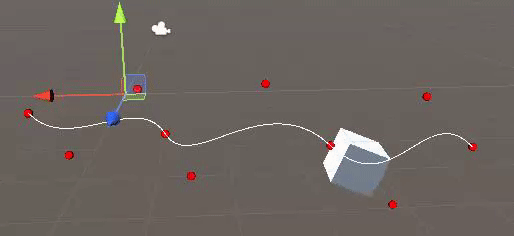

# Spline Editor

## How to run:
Launch this project form unity Hub or go into Assets\Scenes and click on SampleScene.unity.

## Features:
- Create spline
- Save and load spline
- can draw and edit curve with handle
- Play an animation